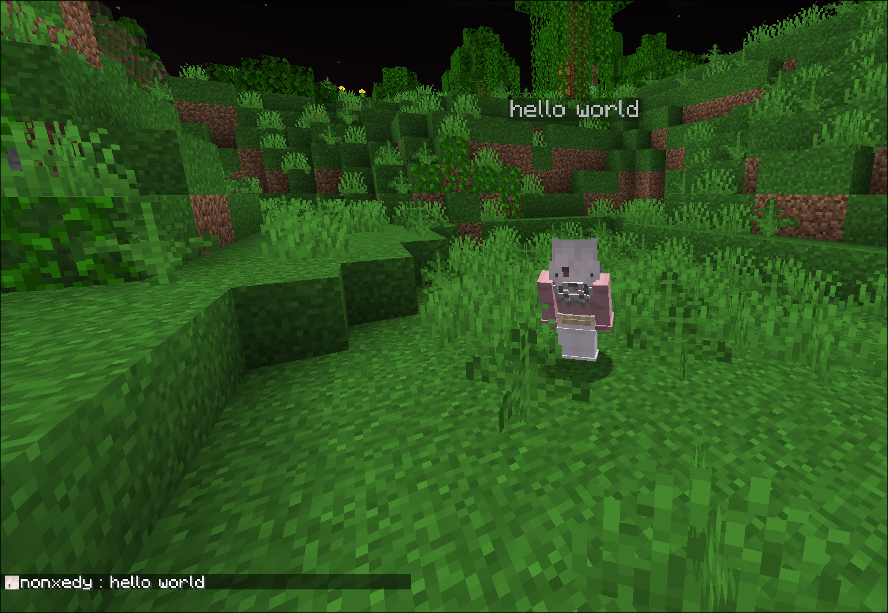
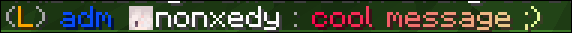
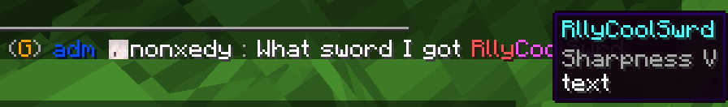

  
  
  # nonchat
  
  
  
  
  

  *The most elegant chat solution for your Minecraft server*

## ✨ Features

- 🎨 **Custom Chat Formats** - Fully customizable chat messages with HEX color support
- 💬 **Private Messaging** - Enhanced private chat system with spy functionality
- 🔔 **Player Pings** - Mention players in chat with customizable sounds and highlights
- 💭 **Chat Bubbles** - Display messages above players' heads
- 📢 **Auto Broadcasting** - Schedule automatic server announcements
- ⚰️ **Custom Death Messages** - Stylish death announcements
- 🎭 **Roleplay Commands** - Enhanced RP experience with /me and /roll commands
- 🔒 **Staff Chat** - Private communication for staff members
- 💡 **Hover Messages** - Interactive hover text with additional information
- 🔗 **DiscordSRV Integration** - Seamless chat synchronization between Minecraft and Discord
- 📱 **Interactive Chat Placeholders** - Dynamic placeholders for enhanced chat experience:
  - `[ping]` - Display your current ping with color-coded status
  - `[item]` - Show your held item with detailed hover information
- 🛡️ **Advanced Chat Filters** - Comprehensive protection systems:
  - **Anti-Advertisement** - Blocks server advertisements with customizable sensitivity
  - **Caps Filter** - Prevents excessive use of capital letters
  - **Word Filter** - Blocks inappropriate content and regex patterns

## 🎮 Commands

| Command | Description |
|---------|-------------|
| `/broadcast` | Send server-wide announcements |
| `/msg` | Send private messages |
| `/reply` | Reply to the last private message |
| `/clear` | Clear chat history |
| `/ignore` | Ignore specific players |
| `/spy` | Toggle private message spy mode |
| `/me` | Send a first-person message |
| `/roll` | RP roll dice |
| `/channel` | Channel management commands |
| `/nonchat help` | View plugin help |
| `/nonchat reload` | Reload plugin configuration |
| `/nonchat version` | Show plugin version |

## 🔧 Interactive Chat Placeholders

nonchat supports dynamic placeholders that make your chat more interactive and informative:

### 📊 Ping Placeholder
Use `[ping]` in your messages to display your current connection latency:
- **Green** (< 100ms) - Excellent connection
- **Gold** (100-300ms) - Good connection  
- **Red** (> 300ms) - Poor connection

**Example:** `My ping is [ping]` → `My ping is 45ms`

### 🎒 Item Placeholder
Use `[item]` in your messages to showcase the item you're currently holding:
- Displays item name with rarity-based coloring
- Hover over the item name to see detailed information
- Shows enchantments, durability, and other item properties
- Automatically detects if you're not holding anything

**Example:** `Check out this [item]!` → `Check out this Diamond Sword!` (with hover details)

## 🚀 Quick Start

1. Download nonchat from [Modrinth](https://modrinth.com/plugin/nonchat)
2. Place the .jar file in your server's `plugins` folder
3. Start/restart your server
4. Configure in `plugins/nonchat/config.yml`

## 📚 Documentation

Visit our [Wiki](https://github.com/nonxedy/nonchat/wiki) for detailed setup instructions and configuration guides.

## 🌟 Why nonchat?

- **Performance Optimized** - Built with efficiency in mind
- **Modern Features** - Supports latest Minecraft versions (1.16-1.21.8)
- **Interactive Elements** - Dynamic placeholders for enhanced player experience
- **Easy Configuration** - Simple YAML configuration with messages.yml support
- **Active Development** - Regular updates and feature additions

## 📋 Development Roadmap

| Status | Task |
|:------:|------|
| ⏳ | Make channel names clickable to switch to them |
| ✅ | Add more placeholders (placeholder that returns your current channel) |

**Legend:**
- ✅ Completed
- ⏳ In Progress
- 🔜 Planned

## 🔧 Support

- [Discord Community](https://discord.gg/NAWsxe3J3R)
- [Issue Tracker](https://github.com/nonxedy/nonchat/issues)
- [Wiki Documentation](https://github.com/nonxedy/nonchat/wiki)

## 💝 Support the Development

If you enjoy nonchat, consider supporting its development:
- [Boosty](https://boosty.to/nonxedy)

## 📸 Screenshots

  
  
  
  
  
  

## 📝 License

nonchat is licensed under MIT License.

---

  Made with ❤️ by nonxedy

