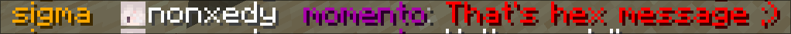
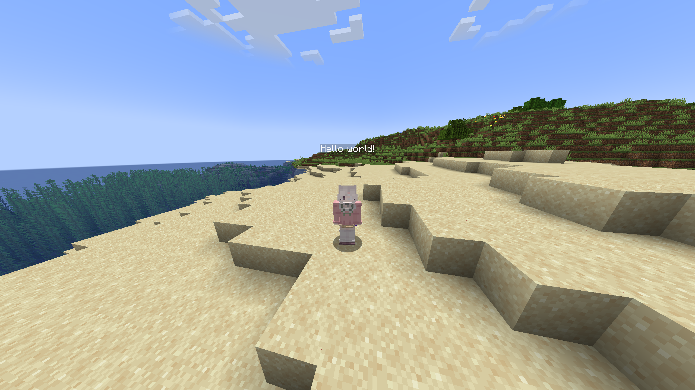

  
  
  # nonchat
  
  
  
  
  

  *The most elegant chat solution for your Minecraft server*

## ✨ Features

- 🎨 **Custom Chat Formats** - Fully customizable chat messages with HEX color support
- 💬 **Private Messaging** - Enhanced private chat system with spy functionality
- 🔔 **Player Pings** - Mention players in chat with customizable sounds and highlights
- 💭 **Chat Bubbles** - Display messages above players' heads
- 📢 **Auto Broadcasting** - Schedule automatic server announcements
- 🛡️ **Word Filter** - Protect your chat from inappropriate content
- ⚰️ **Custom Death Messages** - Stylish death announcements

## 🎮 Commands

| Command | Description |
|---------|-------------|
| `/broadcast` | Send server-wide announcements |
| `/msg` | Send private messages |
| `/clear` | Clear chat history |
| `/ignore` | Ignore specific players |
| `/spy` | Toggle private message spy mode |
| `/sc` | Staff chat channel |
| `/server` | Server management commands |
| `/nhelp` | View plugin help |
| `/nreload` | Reload plugin configuration |

## 🚀 Quick Start

1. Download nonchat from [Modrinth](https://modrinth.com/plugin/nonchat)
2. Place the .jar file in your server's `plugins` folder
3. Start/restart your server
4. Configure in `plugins/nonchat/config.yml`

## 📚 Documentation

Visit our [Wiki](https://github.com/nonxedy/nonchat/wiki) for detailed setup instructions and configuration guides.

## 🌟 Why nonchat?

- **Performance Optimized** - Built with efficiency in mind
- **Modern Features** - Supports latest Minecraft versions (1.20.6-1.21.4)
- **Easy Configuration** - Simple YAML configuration with messages.yml support
- **Active Development** - Regular updates and feature additions

## 📋 Development Roadmap

| Status | Task |
|:------:|------|
| ✅ | Add documentation for code |
| ✅ | Add documentation for plugin |
| ✅ | Add description for plugin |
| ✅ | Add support for other versions |
| ✅ | Improve code structure |
| 🔜 | Add local and global chats |
| 🔜 | Add multi-language support |

**Legend:**
- ✅ Completed
- ⏳ In Progress
- 🔜 Planned

## 🔧 Support

- [Discord Community](https://discord.gg/NAWsxe3J3R)
- [Issue Tracker](https://github.com/nonxedy/nonchat/issues)
- [Wiki Documentation](https://github.com/nonxedy/nonchat/wiki)

## 💝 Support the Development

If you enjoy nonchat, consider supporting its development:
- [Boosty](https://boosty.to/nonxedy)

## 📸 Screenshots

  
  
  

## 📝 License

nonchat is licensed under MIT License.

---

  Made with ❤️ by nonxedy

